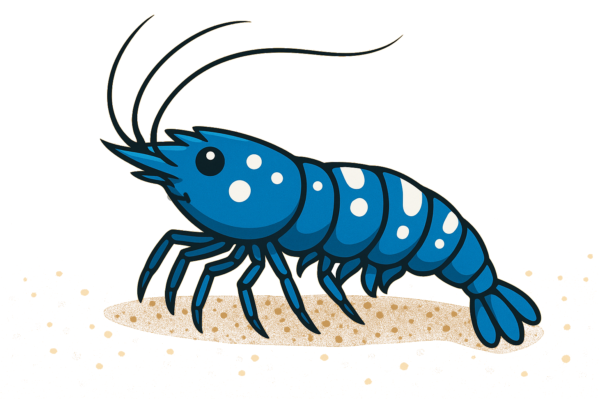

# uduwat

Here we are — sooner or later this moment had to come.

## Elsewhere

Side notes, experiments and things in progress:

- GitHub Gists - https://gist.github.com/uduwat 
- GDClouders - https://github.com/GDClouders 
- LinkedIn - https://www.linkedin.com/in/landi-lrz/ 

Platform Engineer working primarily on Kubernetes-based environments.

I build and operate platforms with a strong focus on reliability, repeatability and long-term maintainability.
Most of my work revolves around cluster lifecycle management, automation and multi-cluster orchestration.

I like working at the abstraction layer where infrastructure details start to fade and systems become reproducible patterns.  
**Cattle, not pets.**

## What I work on

- Kubernetes cluster bootstrap, upgrades and scaling
- Multi-cluster management and add-on orchestration
- Infrastructure as Code and automation
- Platform standardization across environments

## Technologies

- Kubernetes
- Cluster API
- Project Sveltos
- Helm
- Terraform
- Linux
- Bash scripting

Infrastructure is infrastructure — abstractions matter more than where it runs.

## Approach

I prefer simple, understandable systems over clever ones.
I care about operational clarity, reducing manual work and making things boring in production.

Currently working mainly on private infrastructure, while continuously exploring cloud-native and public cloud ecosystems.

---

No hype. No buzzwords.
Just platforms that work — usually built while listening to punk.
